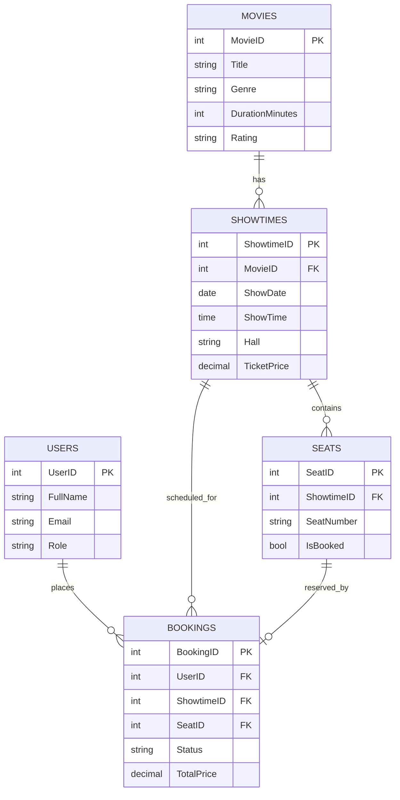

<div align="center">


# CineBook

**A premium movie ticket booking experience, built end-to-end in C# and SQL Server.**

[](https://dotnet.microsoft.com/)
[](https://learn.microsoft.com/en-us/dotnet/csharp/)
[](https://www.microsoft.com/en-us/sql-server)
[](#license)

[](https://github.com/Mazennaji/CineBook/stargazers)
[](https://github.com/Mazennaji/CineBook/issues)
[](https://github.com/Mazennaji/CineBook/commits/main)

</div>

<br/>

<div align="center">
  
  &nbsp;&nbsp;&nbsp;
  
  &nbsp;&nbsp;&nbsp;
  
  &nbsp;&nbsp;&nbsp;
  
</div>

<br/>

## ✨ Overview

**CineBook** is a desktop movie ticket booking system built as a Visual Programming (CSCI370) project. It goes beyond CRUD basics with a genuinely interactive seat map, role-based dashboards, and database-level integrity guarantees — no two users can ever book the same seat.

| | |
|---|---|
| 🎬 **Browse** | Filter movies by genre, see live seat availability per showtime |
| 🪑 **Book** | Click-to-select visual seat map — not a dropdown |
| ❌ **Cancel** | Instant seat release back into the pool |
| 🛠️ **Admin** | Full control over the movie catalog and showtime schedule |

<br/>

## 🖥️ Tech Stack

<div align="center">

| Layer | Technology |
|:---:|:---:|
| **UI** |  C# WinForms |
| **Runtime** |  .NET 8 |
| **Database** |  SQL Server (ADO.NET) |
| **IDE** |  Visual Studio |

</div>

<br/>

## 🏗️ Architecture

```
CineBook/
├── Database/
│   └── CineBook_Schema.sql       → tables, trigger, seed data, view
├── Forms/
│   ├── LoginForm                 → authentication entry point
│   ├── RegisterForm              → self-service signup
│   ├── BrowseMoviesForm          → catalog + showtime browser
│   ├── SeatBookingForm           → interactive seat map
│   ├── MyBookingsForm            → booking history + cancellation
│   └── AdminDashboardForm        → movie & showtime management
├── Helpers/
│   └── DatabaseHelper.cs         → parameterized ADO.NET access layer
├── Models/
│   └── Models.cs                 → User, Movie, Showtime, Seat, Booking
└── Program.cs
```

**Database schema** — 5 tables, 1 trigger, 1 view:



<br/>

## 🚀 Getting Started

### Prerequisites
- Visual Studio 2022+ with the **.NET desktop development** workload
- SQL Server (Express edition is fine) + SQL Server Management Studio

### 1 — Set up the database
Open `Database/CineBook_Schema.sql` in SSMS and run it. This creates the `CineBook` database, all tables, the seat-generation trigger, and seed data.

### 2 — Point the app at your SQL Server instance
In `Helpers/DatabaseHelper.cs`, confirm the connection string matches your instance name:
```csharp
Data Source=.\SQLEXPRESS;Initial Catalog=CineBook;Integrated Security=True;
```

### 3 — Run it
Open `CineBook.csproj` in Visual Studio, let NuGet restore `System.Data.SqlClient`, then hit **F5**.

<br/>

## 🔑 Demo Accounts

| Role | Email | Password |
|:---:|:---|:---:|
| 🛡️ Admin | `admin@cinebook.com` | `admin123` |
| 🎟️ User | `mazen@cinebook.com` | `user123` |
| 🎟️ User | `sara@cinebook.com` | `user123` |

<br/>

## 🎯 How Seat Locking Works

Each showtime gets its **own seat map** generated automatically by a SQL trigger the moment an admin creates it — no manual seat entry, ever.

```
Admin adds Showtime  →  trg_GenerateSeats fires  →  Seats A1...E10 created
User books Seat A4   →  IsBooked = 1 + Booking row inserted
User cancels         →  IsBooked = 0 → seat returns to the pool instantly
```

A `UNIQUE (ShowtimeID, SeatNumber)` constraint makes double-booking structurally impossible — not just a UI rule, enforced by the database itself.

<br/>

## 🗺️ Roadmap

- [ ] Poster images on the Browse Movies screen (`PosterPath` column already exists)
- [ ] Password hashing via `BCrypt.Net`
- [ ] Admin analytics view (top-grossing movies, busiest showtimes)

<br/>

## 📄 License

This project was built for academic purposes (CSCI370 — Visual Programming). Feel free to fork and build on it.

<br/>

<div align="center">

Built with  by **Mazen Naji**

 [github.com/Mazennaji](https://github.com/Mazennaji)

</div>
